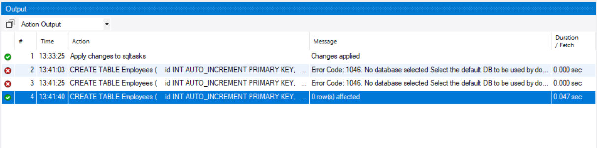
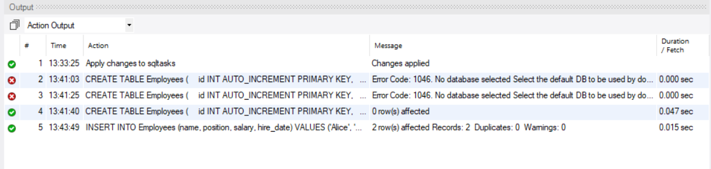
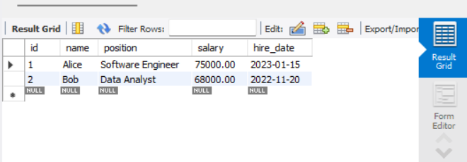

# MySQL: Creating and Populating Tables

## Objective
This task demonstrates how to create a simple table, insert data, and retrieve that data using basic SQL queries in MySQL Workbench.

## Requirements
- Use `CREATE TABLE` to define a table with appropriate data types and constraints.
- Populate the table using `INSERT INTO` with multiple rows of sample data.
- Execute a `SELECT` query to verify the data insertion.

## Steps

### 1. Creating the Table
We will create an `Employees` table

```sql
CREATE TABLE Employees (
    id INT AUTO_INCREMENT PRIMARY KEY,
    name VARCHAR(100) NOT NULL,
    position VARCHAR(50) NOT NULL,
    salary DECIMAL(10,2) NOT NULL,
    hire_date DATE NOT NULL
);
```



### 2. Inserting Sample Data

```sql
INSERT INTO Employees (name, position, salary, hire_date) VALUES
('Alice', 'Software Engineer', 75000.00, '2023-01-15'),
('Bob', 'Data Analyst', 68000.00, '2022-11-20')
```



### 3. Retrieving Data
To verify that the data was inserted correctly, execute:

```sql
SELECT * FROM Employees;
```




## Running the Queries in MySQL Workbench
1. Open **MySQL Workbench**.
2. Connect to your MySQL server.
3. Open a new SQL script editor.
4. Copy and paste the SQL queries from above.
5. Execute them one by one.
6. Verify the output in the results tab.


