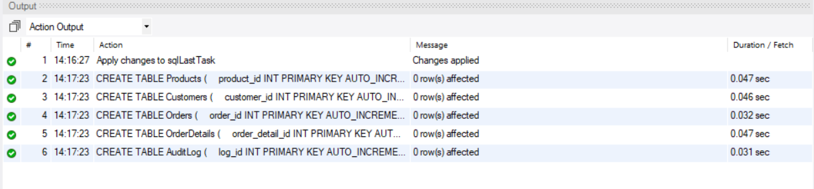
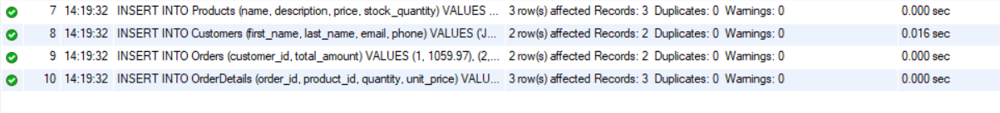
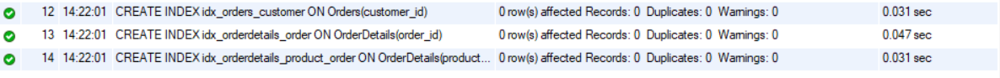
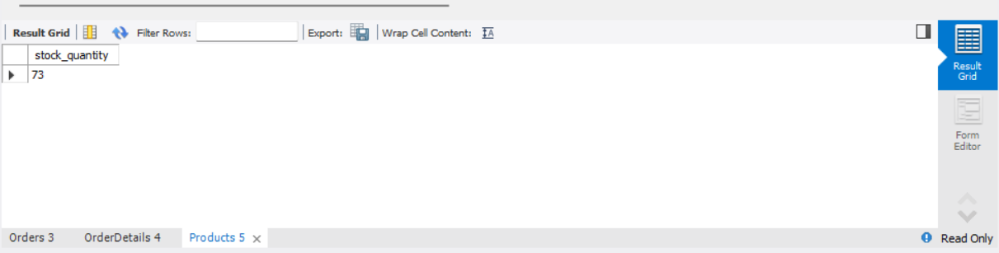
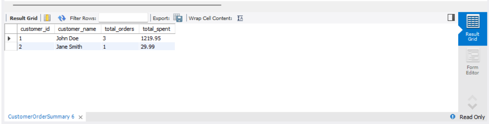
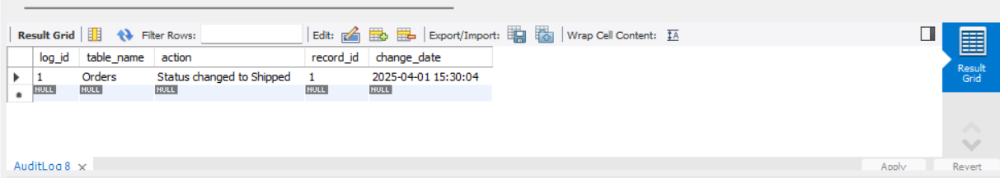
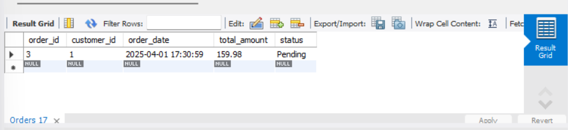

# Comprehensive Database Design, Optimization, and Advanced Features

## Objective
 Design a normalized database schema for an eCommerce platform, implementing advanced SQL features to ensure performance, data integrity, and automation.

## Requirements
- Design and create multiple related tables (e.g., Products, Customers, Orders, OrderDetails) with proper primary and foreign keys, unique constraints, and normalization practices.
- Analyze query performance and apply indexing strategies to optimize frequently executed queries.
- Implement triggers to enforce business rules automatically (e.g., update inventory levels upon order insertion, log changes to critical tables).
- Use transactions (BEGIN TRANSACTION, COMMIT, and ROLLBACK) to ensure data consistency during multi-step operations (e.g., order processing where multiple tables are updated).
- Create views to simplify complex joins and aggregations.
- Optionally, design materialized views if your SQL dialect supports them to cache expensive query results.
- Document your schema and SQL scripts.
- Write test queries to demonstrate that all constraints, triggers, and transactions work as intended.

## Queries

### Schema Design
The schema includes four main tables.
```sql
CREATE TABLE Products (
    product_id INT PRIMARY KEY AUTO_INCREMENT,
    name VARCHAR(100) NOT NULL,
    description TEXT,
    price DECIMAL(10, 2) NOT NULL CHECK (price >= 0),
    stock_quantity INT NOT NULL CHECK (stock_quantity >= 0),
    UNIQUE (name)
);

CREATE TABLE Customers (
    customer_id INT PRIMARY KEY AUTO_INCREMENT,
    first_name VARCHAR(50) NOT NULL,
    last_name VARCHAR(50) NOT NULL,
    email VARCHAR(100) NOT NULL UNIQUE,
    phone VARCHAR(20),
    created_at TIMESTAMP DEFAULT CURRENT_TIMESTAMP
);

CREATE TABLE Orders (
    order_id INT PRIMARY KEY AUTO_INCREMENT,
    customer_id INT NOT NULL,
    order_date TIMESTAMP DEFAULT CURRENT_TIMESTAMP,
    total_amount DECIMAL(10, 2) NOT NULL CHECK (total_amount >= 0),
    status ENUM('Pending', 'Shipped', 'Delivered', 'Cancelled') DEFAULT 'Pending',
    FOREIGN KEY (customer_id) REFERENCES Customers(customer_id)
);

CREATE TABLE OrderDetails (
    order_detail_id INT PRIMARY KEY AUTO_INCREMENT,
    order_id INT NOT NULL,
    product_id INT NOT NULL,
    quantity INT NOT NULL CHECK (quantity > 0),
    unit_price DECIMAL(10, 2) NOT NULL CHECK (unit_price >= 0),
    FOREIGN KEY (order_id) REFERENCES Orders(order_id),
    FOREIGN KEY (product_id) REFERENCES Products(product_id)
);

CREATE TABLE AuditLog (
    log_id INT PRIMARY KEY AUTO_INCREMENT,
    table_name VARCHAR(50),
    action VARCHAR(50),
    record_id INT,
    change_date TIMESTAMP DEFAULT CURRENT_TIMESTAMP
);

```



### 1. Insert sample Data
```sql
-- Products
INSERT INTO Products (name, description, price, stock_quantity) VALUES
('Laptop', 'High-performance laptop', 999.99, 50),
('Mouse', 'Wireless mouse', 29.99, 100),
('Keyboard', 'Mechanical keyboard', 79.99, 75);

-- Customers
INSERT INTO Customers (first_name, last_name, email, phone) VALUES
('John', 'Doe', 'john.doe@email.com', '123-456-7890'),
('Jane', 'Smith', 'jane.smith@email.com', '098-765-4321');

-- Orders
INSERT INTO Orders (customer_id, total_amount) VALUES
(1, 1059.97),
(2, 29.99);

-- OrderDetails
INSERT INTO OrderDetails (order_id, product_id, quantity, unit_price) VALUES
(1, 1, 1, 999.99),
(1, 2, 2, 29.99),
(2, 2, 1, 29.99);
```



### 2. Indexing and Performance
Optimize frequent queries:
```sql

CREATE INDEX idx_orders_customer ON Orders(customer_id);

CREATE INDEX idx_orderdetails_order ON OrderDetails(order_id);

CREATE INDEX idx_orderdetails_product_order ON OrderDetails(product_id, order_id);
```



### 3.Trigger
Inventory update Trigger
```sql
DELIMITER //
CREATE TRIGGER update_inventory_after_order
AFTER INSERT ON OrderDetails
FOR EACH ROW
BEGIN
    IF (SELECT stock_quantity FROM Products WHERE product_id = NEW.product_id) < NEW.quantity THEN
        SIGNAL SQLSTATE '45000' SET MESSAGE_TEXT = 'Insufficient stock';
    END IF;
    UPDATE Products
    SET stock_quantity = stock_quantity - NEW.quantity
    WHERE product_id = NEW.product_id;
END //
DELIMITER ;
```


### 4.Audit Log Trigger
```sql
DELIMITER //
CREATE TRIGGER log_order_changes
AFTER UPDATE ON Orders
FOR EACH ROW
BEGIN
    INSERT INTO AuditLog (table_name, action, record_id)
    VALUES ('Orders', CONCAT('Status changed to ', NEW.status), OLD.order_id);
END //
DELIMITER ;
```

### 6.Transactions

```sql
DELIMITER //

CREATE PROCEDURE ProcessOrder(
    IN cust_id INT,
    IN prod_id INT,
    IN qty INT
)
BEGIN
    DECLARE order_id INT;
    DECLARE unit_price DECIMAL(10, 2);
    
    DECLARE EXIT HANDLER FOR SQLEXCEPTION
    BEGIN
        ROLLBACK;
        SIGNAL SQLSTATE '45000' SET MESSAGE_TEXT = 'An error occurred during order processing';
    END;
    
    START TRANSACTION;
    
    -- Get product price
    SELECT price INTO unit_price 
    FROM Products 
    WHERE product_id = prod_id;
    
    -- Create order
    INSERT INTO Orders (customer_id, total_amount)
    VALUES (cust_id, unit_price * qty);
    
    SET order_id = LAST_INSERT_ID();
    
    -- Add order details
    INSERT INTO OrderDetails (order_id, product_id, quantity, unit_price)
    VALUES (order_id, prod_id, qty, unit_price);
    
    COMMIT; 
END //

DELIMITER ;
```

### 7.Test Transaction

```sql
CALL ProcessOrder(1, 3, 2); 
SELECT * FROM Orders WHERE customer_id = 1;
SELECT * FROM OrderDetails WHERE order_id = (SELECT MAX(order_id) FROM Orders);
SELECT stock_quantity FROM Products WHERE product_id = 3; 
```


### 8. Views

```sql
CREATE VIEW CustomerOrderSummary AS
SELECT 
    c.customer_id,
    CONCAT(c.first_name, ' ', c.last_name) AS customer_name,
    COUNT(o.order_id) AS total_orders,
    SUM(od.quantity * od.unit_price) AS total_spent
FROM Customers c
LEFT JOIN Orders o ON c.customer_id = o.customer_id
LEFT JOIN OrderDetails od ON o.order_id = od.order_id
GROUP BY c.customer_id, c.first_name, c.last_name;
```

### 9.Test View
```sql
SELECT * FROM CustomerOrderSummary;
```


### 10.Test Constraints
```sql
-- Test negative stock (should fail due to trigger)
INSERT INTO OrderDetails (order_id, product_id, quantity, unit_price)
VALUES (1, 1, 1000, 999.99);
```

```sql
Error Code: 1644. Insufficient stock
```

### 11.Test Triggers
```sql
UPDATE Orders SET status = 'Shipped' WHERE order_id = 1;
SELECT * FROM AuditLog;
```


### 12.Test Transaction Rollback
```sql
START TRANSACTION;
INSERT INTO Orders (customer_id, total_amount) VALUES (1, 100.00);
INSERT INTO OrderDetails (order_id, product_id, quantity, unit_price)
VALUES (LAST_INSERT_ID(), 999, 1, 50.00); -- Invalid product_id
ROLLBACK;
SELECT * FROM Orders ORDER BY order_id DESC LIMIT 1; -- Should not include failed order
```
```
Error Code: 1452. Cannot add or update a child row: a foreign key constraint fails (`sqllasttask`.`orderdetails`, CONSTRAINT `orderdetails_ibfk_2` FOREIGN KEY (`product_id`) REFERENCES `products` (`product_id`))

```



