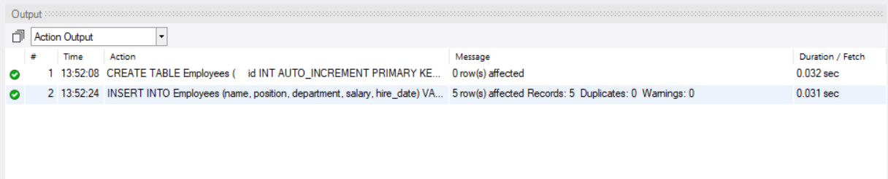
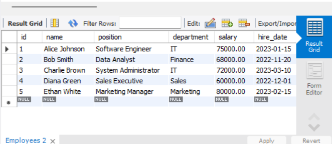
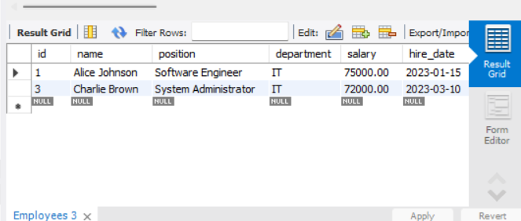
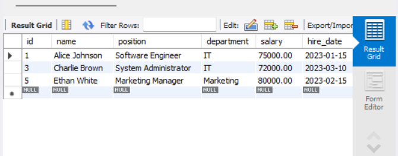
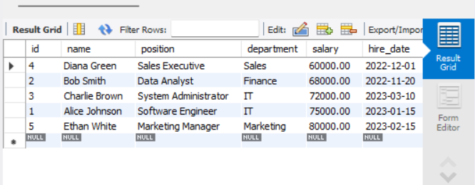
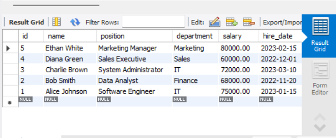
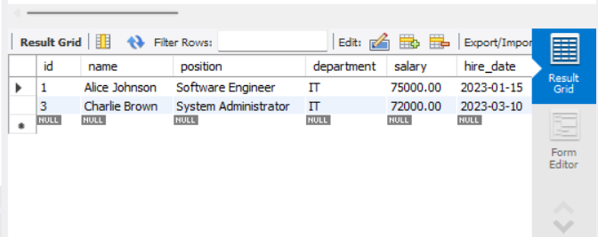
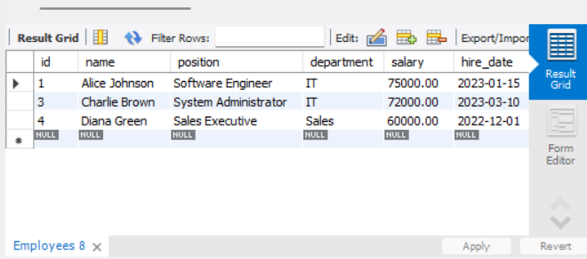

# Basic Filtering and Sorting

## Objective
 Write queries that filter records and sort the result set.

## Requirements
- Use the WHERE clause to filter records based on a condition (e.g., WHERE Department = 'Sales').
- Apply the ORDER BY clause to sort the results (e.g., by LastName or Salary).
- Experiment with multiple conditions using AND/OR.

## Steps

### 1. Creating the Table
We will create an `Employees`

```sql
CREATE TABLE Employees (
    id INT AUTO_INCREMENT PRIMARY KEY,
    name VARCHAR(100) NOT NULL,
    position VARCHAR(50) NOT NULL,
    department VARCHAR(50) NOT NULL,
    salary DECIMAL(10,2) NOT NULL,
    hire_date DATE NOT NULL
);
```

### 2. Inserting Sample Data

```sql
INSERT INTO Employees (name, position, department, salary, hire_date) VALUES
('Alice Johnson', 'Software Engineer', 'IT', 75000.00, '2023-01-15'),
('Bob Smith', 'Data Analyst', 'Finance', 68000.00, '2022-11-20'),
('Charlie Brown', 'System Administrator', 'IT', 72000.00, '2023-03-10'),
('Diana Green', 'Sales Executive', 'Sales', 60000.00, '2022-12-01'),
('Ethan White', 'Marketing Manager', 'Marketing', 80000.00, '2023-02-15');
```



### 3. Retrieving Data
To verify that the data was inserted correctly, execute:

```sql
SELECT * FROM Employees;
```



### 4. Filtering Records
To filter employees from the IT department:

```sql
SELECT * FROM Employees WHERE department = 'IT';
```


To filter employees with a salary greater than 70,000:

```sql
SELECT * FROM Employees WHERE salary > 70000;
```


### 5. Sorting Results
To sort employees by salary in ascending order:

```sql
SELECT * FROM Employees ORDER BY salary ASC;
```


To sort employees by name in descending order:

```sql
SELECT * FROM Employees ORDER BY name DESC;
```



### 6. Using Multiple Conditions
To find employees in the IT department earning more than 70,000:

```sql
SELECT * FROM Employees WHERE department = 'IT' AND salary > 70000;
```


To find employees in either IT or Sales departments:

```sql
SELECT * FROM Employees WHERE department = 'IT' OR department = 'Sales';
```



