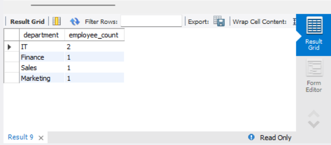
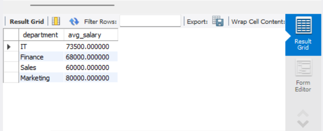
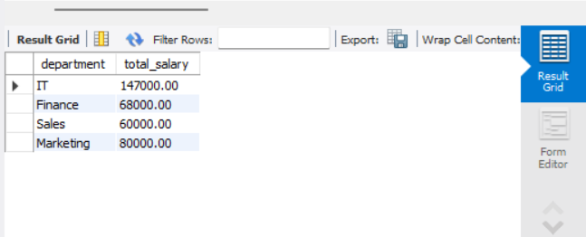
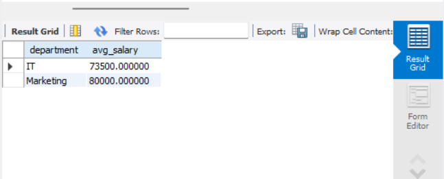

# Simple Aggregation and Grouping

## Objective
 Summarize data using aggregate functions and grouping.

## Requirements
- Write a query that uses aggregate functions such as COUNT(), SUM(), or AVG() to calculate totals or averages.
- Use the GROUP BY clause to aggregate data by a specific column (e.g., count the number of employees per department).
- Optionally, filter grouped results using the HAVING clause.

## Steps

### 1. Creating the Table
We will create an `Employees` table 

```sql
CREATE TABLE Employees (
    id INT AUTO_INCREMENT PRIMARY KEY,
    name VARCHAR(100) NOT NULL,
    position VARCHAR(50) NOT NULL,
    department VARCHAR(50) NOT NULL,
    salary DECIMAL(10,2) NOT NULL,
    hire_date DATE NOT NULL
);
```

### 2. Inserting Sample Data

```sql
INSERT INTO Employees (name, position, department, salary, hire_date) VALUES
('Alice Johnson', 'Software Engineer', 'IT', 75000.00, '2023-01-15'),
('Bob Smith', 'Data Analyst', 'Finance', 68000.00, '2022-11-20'),
('Charlie Brown', 'System Administrator', 'IT', 72000.00, '2023-03-10'),
('Diana Green', 'Sales Executive', 'Sales', 60000.00, '2022-12-01'),
('Ethan White', 'Marketing Manager', 'Marketing', 80000.00, '2023-02-15');
```

### 3. Aggregation and Grouping
To count the number of employees in each department:

```sql
SELECT department, COUNT(*) AS employee_count FROM Employees GROUP BY department;
```


To find the average salary per department:

```sql
SELECT department, AVG(salary) AS avg_salary FROM Employees GROUP BY department;
```


To find the total salary expenditure per department:

```sql
SELECT department, SUM(salary) AS total_salary FROM Employees GROUP BY department;
```


### 4. Filtering Grouped Results Using HAVING
To filter departments where the average salary is greater than 70,000:

```sql
SELECT department, AVG(salary) AS avg_salary FROM Employees GROUP BY department HAVING avg_salary > 70000;
```


