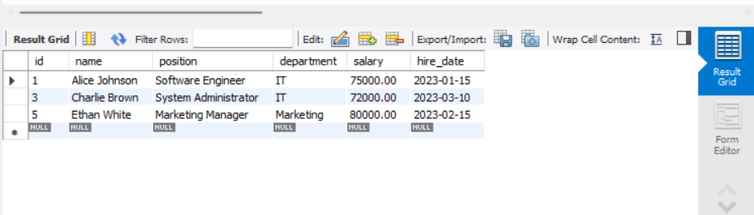
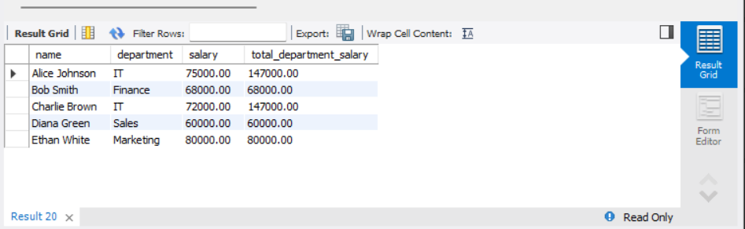
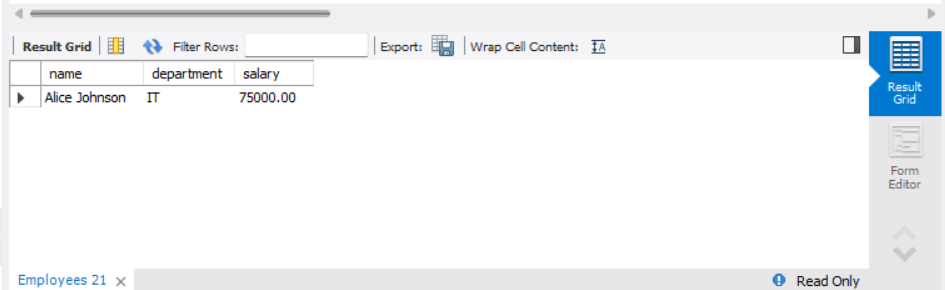
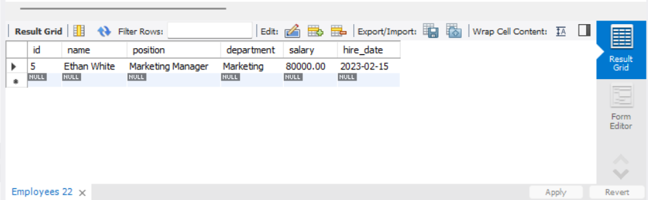

# Subqueries and Nested Queries

## Objective
 Use subqueries to filter or compute values within a main query.

## Requirements
- Write a query that uses a subquery in the WHERE clause (e.g., select employees whose salary is above the department’s average salary).
- Alternatively, use subqueries in the SELECT list to compute dynamic columns.
- Understand the difference between correlated and non-correlated subqueries.

## Steps

### 1. Query that uses a subquery in the WHERE Clause
Select employees whose salary is above the department's average salary

```sql
SELECT * FROM Employees 
WHERE salary > (SELECT AVG(salary) FROM Employees WHERE department = Employees.department);
```


### 2. Use subqueries in the SELECT list to compute dynamic columns

Use a subquery in the SELECT list to compute the total salary per department

```sql
SELECT name, department, salary, 
       (SELECT SUM(salary) FROM Employees e2 WHERE e2.department = e1.department) AS total_department_salary
FROM Employees e1;
```


### 3. correlated subquery

Correlated Subquery: Find employees who earn more than the average salary of their department

```sql
SELECT name, department, salary 
FROM Employees e1
WHERE salary > (SELECT AVG(salary) FROM Employees e2 WHERE e1.department = e2.department);
```


### 4. non-correlated subquery

Non-Correlated Subquery: Get the highest-paid employee(s)

```sql
SELECT * FROM Employees 
WHERE salary = (SELECT MAX(salary) FROM Employees);
```


