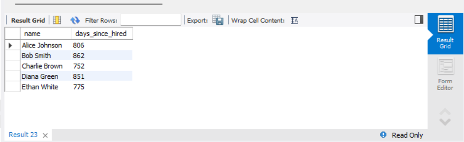
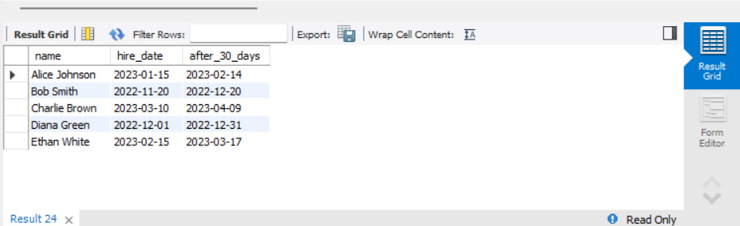
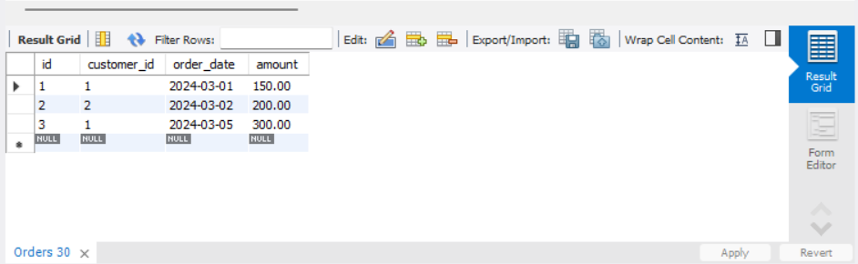
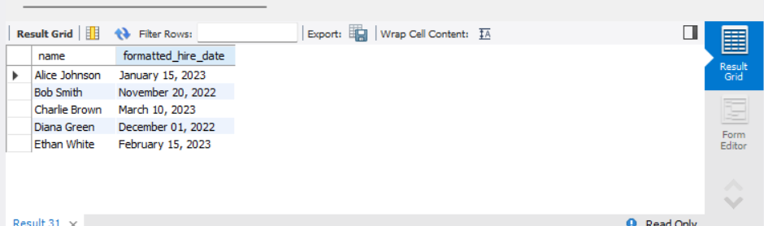

# MySQL: Date and Time Functions

## Objective
Manipulate and query data based on date and time values.

## Requirements
- Use built-in date functions such as `DATEDIFF`, `DATE_ADD`, and `DATE_SUB` to calculate intervals or adjust dates.
- Write a query to filter records based on date ranges (e.g., orders placed within the last 30 days).
- Format date outputs if necessary using functions like CONVERT or TO_CHAR.

## Queries

### 1. Calculate the Difference Between Two Dates
```sql
SELECT name, DATEDIFF(CURDATE(), hire_date) AS days_since_hired
FROM Employees;
```
- This query calculates how many days have passed since each employee was hired.



### 2. Add or Subtract Days from a Date
```sql
SELECT name, hire_date, DATE_ADD(hire_date, INTERVAL 30 DAY) AS after_30_days
FROM Employees;
```
This query adds 30 days to the `hire_date`.


```sql
SELECT name, hire_date, DATE_SUB(hire_date, INTERVAL 10 DAY) AS before_10_days
FROM Employees;
```
This query subtracts 10 days from the `hire_date`.


### 3. Filter Records Based on Date Range
```sql
SELECT * FROM Orders
WHERE order_date >= DATE_SUB(CURDATE(), INTERVAL 530 DAY);
```
Retrieves orders placed within the last 530 days.


### 4. Formatting Date Output
```sql
SELECT name, DATE_FORMAT(hire_date, '%M %d, %Y') AS formatted_hire_date
FROM Employees;
```
Converts `hire_date` into a more readable format like "January 15, 2023".



