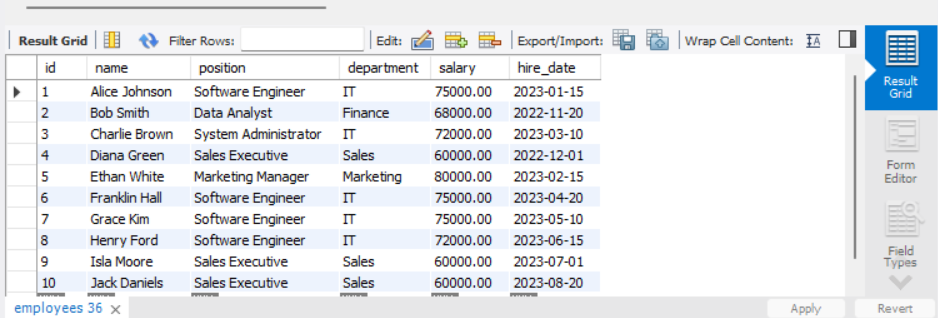
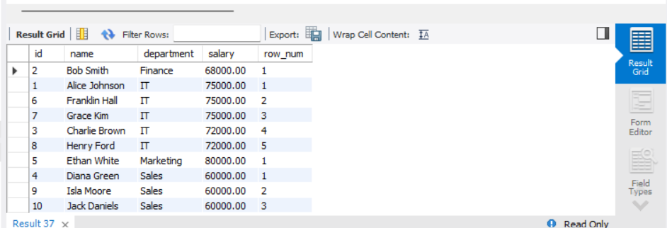
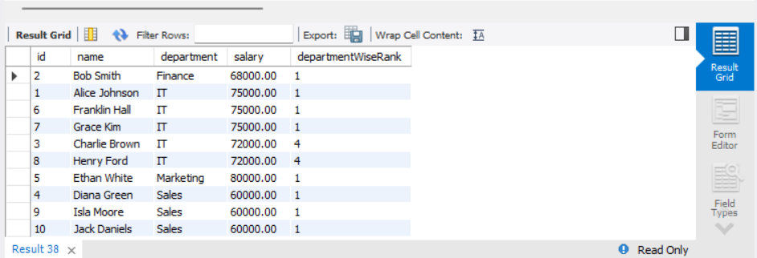
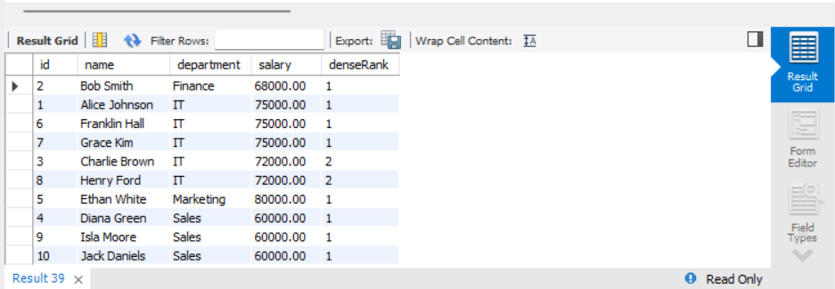
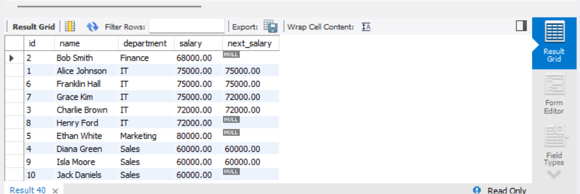
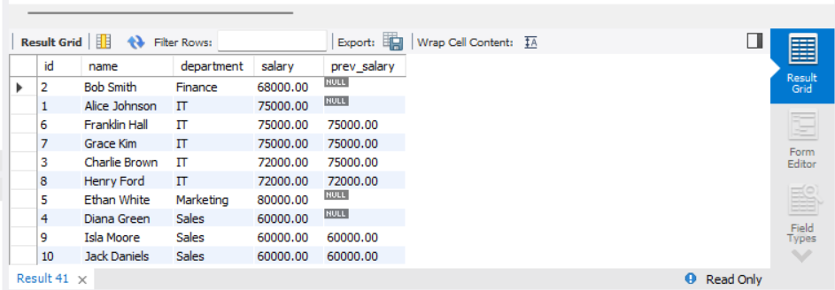

# Window Functions and Ranking

## Objective
 Leverage window functions to perform calculations across a set of rows.

## Requirements
- Write a query using window functions such as ROW_NUMBER(), RANK(), or DENSE_RANK() to assign ranks (e.g., rank employees by salary within each department).
- Use PARTITION BY to define groups and ORDER BY to specify the ranking order.
- Experiment with other window functions like LEAD() or LAG() to access adjacent row values.

## Queries

### Existing Table content



### 1. Assign Row Numbers to Employees Based on Salary
```sql
SELECT id, name, department, salary,
       ROW_NUMBER() OVER (PARTITION BY department ORDER BY salary DESC) AS row_num
FROM Employees;
```
- Assigns a unique row number to employees within each department, ordered by salary in descending order.



### 2. Rank Employees by Salary
```sql
SELECT id, name, department, salary,
       RANK() OVER (PARTITION BY department ORDER BY salary DESC) AS departmentWiseRank
FROM Employees;
```
- Assigns a rank to employees based on salary, skipping ranks if there are ties.



### 3. Assign Dense Ranks
```sql
SELECT id, name, department, salary,
       DENSE_RANK() OVER (PARTITION BY department ORDER BY salary DESC) AS denseRank
FROM Employees;
```
- Similar to `RANK()`, but without skipping numbers when there are ties.



### 4. Use `LEAD()` to Get the Next Employee's Salary
```sql
SELECT id, name, department, salary,
       LEAD(salary) OVER (PARTITION BY department ORDER BY salary DESC) AS next_salary
FROM Employees;
```
- Retrieves the salary of the next employee in the ranking order within the same department.



### 5. Use `LAG()` to Get the Previous Employee's Salary
```sql
SELECT id, name, department, salary,
       LAG(salary) OVER (PARTITION BY department ORDER BY salary DESC) AS prev_salary
FROM Employees;
```
- Retrieves the salary of the previous employee in the ranking order within the same department.


