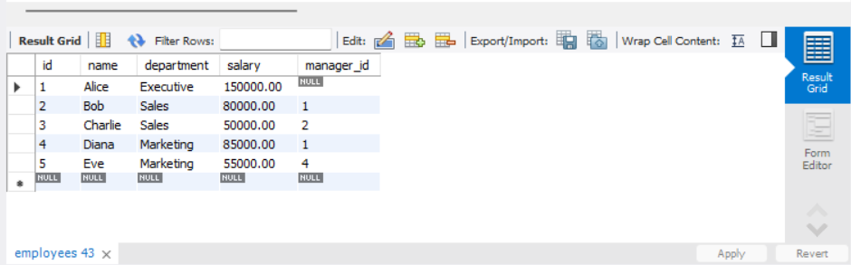
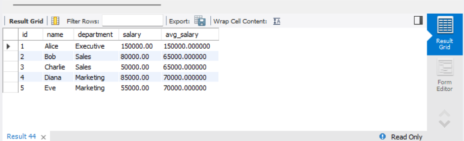
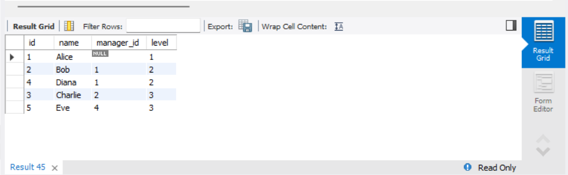
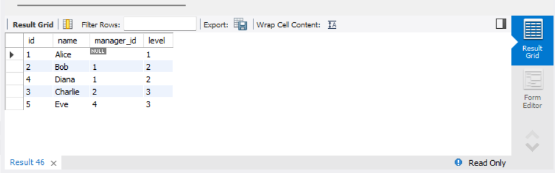

# MySQL: Common Table Expressions (CTEs) and Recursive Queries

## Objective
 Simplify complex queries and process hierarchical data using CTEs.

## Requirements
- Write a non-recursive CTE to structure a multi-step query for readability (e.g., breaking down a complex aggregation).
- Create a recursive CTE to display hierarchical data (e.g., an organizational chart or a category tree).
- Ensure proper termination of the recursive CTE to avoid infinite loops.

## Queries

### existing table


### 1. Using a Non-Recursive CTE for Aggregation
```sql
WITH DepartmentSalaries AS (
    SELECT department, AVG(salary) AS avg_salary
    FROM Employees
    GROUP BY department
)
SELECT e.id, e.name, e.department, e.salary, d.avg_salary
FROM Employees e
JOIN DepartmentSalaries d ON e.department = d.department;
```
- This query calculates the average salary per department using a CTE, making it easier to join with the main `Employees` table.



### 2. Creating a Recursive CTE for Organizational Hierarchy
```sql
WITH RECURSIVE EmployeeHierarchy AS (
    -- Base case: Select top-level managers
    SELECT id, name, manager_id, 1 AS level
    FROM Employees
    WHERE manager_id IS NULL
    
    UNION ALL
    
    -- Recursive case: Join employees to their managers
    SELECT e.id, e.name, e.manager_id, eh.level + 1
    FROM Employees e
    JOIN EmployeeHierarchy eh ON e.manager_id = eh.id
)
SELECT * FROM EmployeeHierarchy ORDER BY level, id;
```
- This query builds an organizational hierarchy by recursively selecting employees under their managers.
- The recursion stops when no more employees report to a manager.



### 3. Ensuring Proper Termination of Recursive CTEs
```sql
WITH RECURSIVE SafeHierarchy AS (
    SELECT id, name, manager_id, 1 AS level
    FROM Employees
    WHERE manager_id IS NULL
    
    UNION ALL
    
    SELECT e.id, e.name, e.manager_id, sh.level + 1
    FROM Employees e
    JOIN SafeHierarchy sh ON e.manager_id = sh.id
    WHERE sh.level < 10  -- Prevent infinite loops
)
SELECT * FROM SafeHierarchy;
```
- Adding `WHERE sh.level < 10` ensures that the recursion does not run indefinitely, which is crucial for large datasets.


