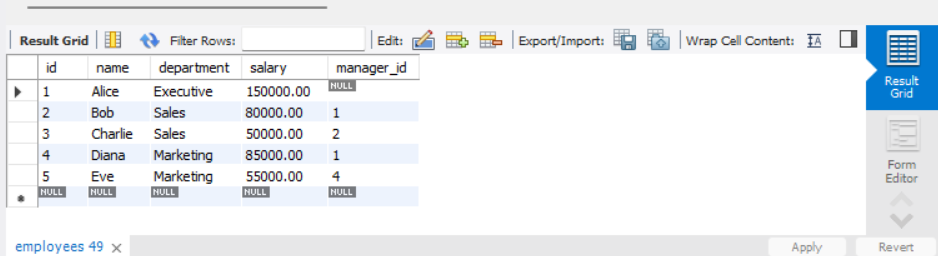
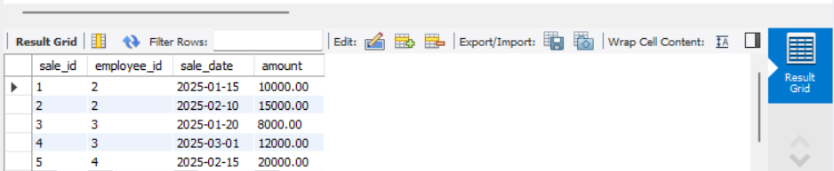
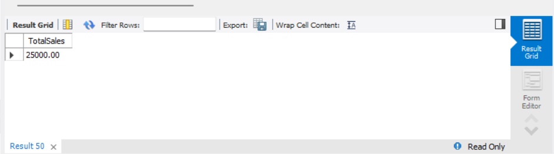
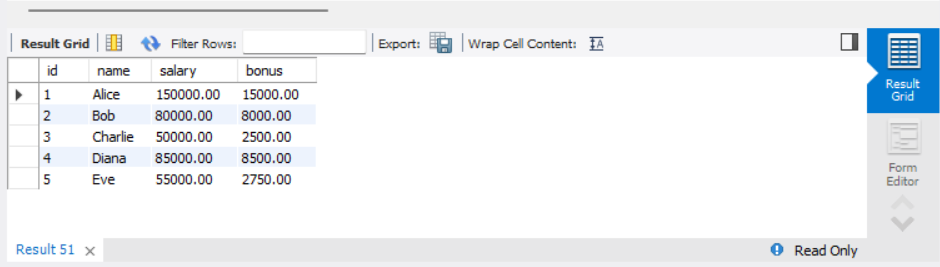

# Stored Procedures and User-Defined Functions

## Objective
 Encapsulate business logic using stored procedures and functions.

## Requirements
- Create a stored procedure that accepts parameters (e.g., a date range) and returns a result set (such as total sales within that range).
- Write a scalar or table-valued user-defined function that performs a calculation (e.g., calculates a discount or bonus based on input parameters).
- Test the procedure and function by calling them and verifying their outputs.

## Queries

### existing table
```sql
CREATE TABLE Employees (
    id INT PRIMARY KEY,
    name VARCHAR(50),
    department VARCHAR(50),
    salary DECIMAL(10, 2),
    manager_id INT,
    FOREIGN KEY (manager_id) REFERENCES Employees(id)
);

CREATE TABLE Sales (
    sale_id INT PRIMARY KEY AUTO_INCREMENT,
    employee_id INT,
    sale_date DATE,
    amount DECIMAL(10, 2),
    FOREIGN KEY (employee_id) REFERENCES Employees(id)
);

INSERT INTO Employees (id, name, department, salary, manager_id) VALUES
(1, 'Alice', 'Executive', 150000.00, NULL),
(2, 'Bob', 'Sales', 80000.00, 1),
(3, 'Charlie', 'Sales', 50000.00, 2),
(4, 'Diana', 'Marketing', 85000.00, 1),
(5, 'Eve', 'Marketing', 55000.00, 4);

INSERT INTO Sales (employee_id, sale_date, amount) VALUES
(2, '2025-01-15', 10000.00),
(2, '2025-02-10', 15000.00),
(3, '2025-01-20', 8000.00),
(3, '2025-03-01', 12000.00),
(4, '2025-02-15', 20000.00);
```



### 1. Stored Procedure
A stored procedure to calculate total sales for a given employee within a specified date range.
```sql
DELIMITER //

CREATE PROCEDURE GetSalesByEmployeeAndDateRange(
    IN emp_id INT,
    IN start_date DATE,
    IN end_date DATE,
    OUT total_sales DECIMAL(10, 2)
)
BEGIN
    SELECT SUM(amount) INTO total_sales
    FROM Sales
    WHERE employee_id = emp_id
    AND sale_date BETWEEN start_date AND end_date;
    
    IF total_sales IS NULL THEN
        SET total_sales = 0.00;
    END IF;
END //

DELIMITER ;
```
```sql
CALL GetSalesByEmployeeAndDateRange(2, '2025-01-01', '2025-02-28', @total);
SELECT @total AS TotalSales;
```



### 2. User-Defined Function
A scalar function to calculate a bonus based on an employee's salary (e.g., 10% bonus if salary > 60000, otherwise 5%).
```sql
DELIMITER //

CREATE FUNCTION CalculateBonus(salary DECIMAL(10, 2))
RETURNS DECIMAL(10, 2)
DETERMINISTIC
BEGIN
    DECLARE bonus_rate DECIMAL(3, 2);
    
    IF salary > 60000 THEN
        SET bonus_rate = 0.10; 
    ELSE
        SET bonus_rate = 0.05;
    END IF;
    
    RETURN salary * bonus_rate;
END //

DELIMITER ;
```

```sql
SELECT 
    id,
    name,
    salary,
    CalculateBonus(salary) AS bonus
FROM Employees;
```


